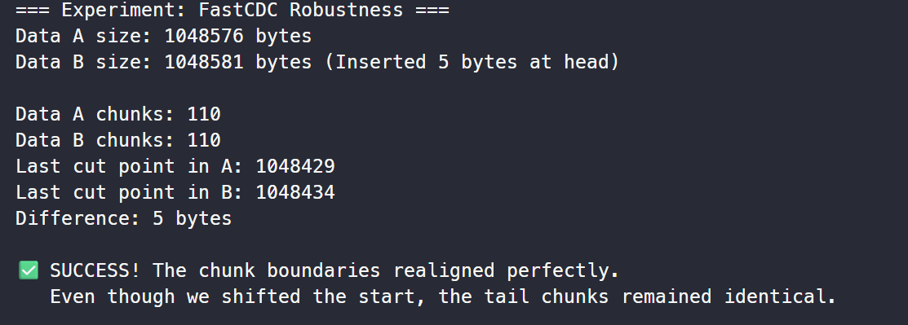

# TensorVault 开发手记 #1：为了存下 AI 模型，我手写了一个 CDC 切分器

## 背景

我们的项目目标是服务于 AI infra 的 git,因而我们不妨先从 git 出发,开始考虑我们需要有哪些区别于 git 的特性

最核心的区别于 git 的就是 git 是基于代码(文本)来进行差异计算以及储存的,而我们要构建的 TensorVault 是一个**数据内容无关 (Content-Agnostic)**,主要用于储存大文件(AI 训练数据等)的工具,我们接下来的一系列博客要确定并实现的一切特性一定都是基于这个前提出发的.

在这一篇博客中,我们从最底层出发,主要考虑**去重与差异计算**方面的新特性

## 技术选型

### 从 Delta 到 CDC(Content Defined Chunking)

git 的颗粒度是行级的,它需要**关注语义**(进而为 diff,merge 等功能提供技术支撑),而我们的 TensorVault 储存的仅仅是数据,我们的**颗粒度更粗**,我们只要确保底层的字节是对的就可以,**不需要关注语义信息**

另一方面,虽然 Git LFS 可以处理大文件，但它本质上是**文件级去重 (File-level Deduplication)**。对于 10GB 的模型，哪怕只改了 1KB 的元数据，LFS 也需要重新存储整个 10GB 文件。这毋宁说只是一个 **git 的补丁**,而非一个针对于粗颗粒度储存的**最优解**.

随着粗颗粒度而来的自然是更加灵活的储存管理方式,同时也不得不放弃了基于语义与内部结构信息的增量压缩(Delta 算法)手段.因为正如前面所说,我们要做的是一个类型无知的工具,它不可能假设文件内部有任何语义上的结构特征,仅仅能从字节层面的结构特征来压缩去重

所以我们需要学习并使用 **CDC(Content Defined Chunking)技术**,它是一种专门用于优化大文件储存的分块技术,通过基于块而不是行的分块,可以降低储存的重复率,节省空间并提高传输效率.

接下来我们需要进一步选择一种适合我们项目的 CDC 技术亚种.

### 初选锁定 Gear+NC

我们注意到一篇 Marcel Gregoriadis 等人在 2024 年发表的论文：[A Thorough Investigation of Content-Defined Chunking Algorithms for Data Deduplication](https://arxiv.org/abs/2409.06066)。其中对于各种现代 CDC 技术进行了比较公正的性能测量。

在论文中，作者指出：基于局部极值的算法（如 RAM）对于低熵数据（即有连续相同值的数据）极易出现**病态分块(Pathological Chunking)**现象，即失效并切出巨大的块；而 AE 虽然表现较好，但在参数调节的准确性上存在理论缺陷, BFBC 等算法对于高熵数据表现较差。

论文的结论是：**Gear Hash（一种滚动哈希）+ NC (Normalized Chunking) 是目前最稳健、综合性能最好的选择之一**。考虑到我们的 AI infra 场景同时会有高熵(如模型参数)与低熵(如稀疏矩阵,0-填充数据),我们可以初步确定下一步筛选的范围.

### 次选锁定 FastCDC

接下来我们的候选者大大减少,既然 FastCDC 正是 Gear Hash + NC 这一组合在工程界的经典实现（或者说 FastCDC 是提出 NC 概念的鼻祖）,那么我们只需要沿着其发展脉络继续梳理即可.

选项可以简化总结为 **FastCDC**,**QuickCDC**,以及 **RapidCDC** ,进一步搜索资料并阅读 joshleeb 的 CDC 系列博客的最后一篇[A Look at RapidCDC and QuickCDC](https://joshleeb.com/posts/quickcdc-rapidcdc.html) ,我们决定选择 FastCDC,可以从如下角度来分析:

- 数据完整性风险：QuickCDC 与 RapidCDC 采用了激进的“跳跃”策略。对于一个头尾没变但中间修改了的块，它们存在误判未修改的风险。在 AI Infra 场景下，这是**静默数据损坏**，是**不可接受**的。

- 架构耦合度：QuickCDC 与 RapidCDC 的切分器必须实时查询并维护一个全局索引表（有状态），这意味着切分与数据库紧耦合。而 FastCDC 是**无状态**的，支持客户端**离线切分**，更符合云原生架构的需求。

- 成熟度:FastCDC 已经经过了比较长期的应用检验

综上,我们决定选用**FastCDC**作为 TensorVault 使用的 CDC 技术亚种

## 核心实现

进一步地,我实现了一个 FastCDC demo,核心逻辑主要是下面几个部分:

1.  首先是预计算出掩码
    ```go
    // 这是 FastCDC 归一化的核心：根据 AvgSize 动态计算两个难度不同的掩码
    bits := int(math.Round(math.Log2(float64(AvgSize))))
    maskS := uint64(1<<(bits+NormLevel)) - 1 // 严掩码 (Mask Small): 1 更多，难切 -> 消除小块
    maskL := uint64(1<<(bits-NormLevel)) - 1 // 宽掩码 (Mask Large): 1 更少，易切 -> 消除大块
    ```
2.  然后就是进入分块的循环逻辑,先是在每次分块之前**跳过最小块**,即直接跳过前 `MinSize` 字节不计算

    ```go
    fp := uint64(0)
    idx := offset + MinSize

    // 确定搜索边界
    // 归一化区域：MinSize ~ AvgSize
    normLimit := min(offset+AvgSize, len(data))

    // 最大边界
    maxLimit := min(offset+MaxSize, len(data))
    ```

3.  接下来确定滚动哈希并尝试分块的逻辑,对于不同区间(`MinSize` ~ `AvgSize`,`AvgSize` ~ `MaxSize`)的操作逻辑是相通的,我们这里抽象为一个`scan`函数,这里的 `cutPoints` 就是我们维护的一个记录分块点的数组
    (注意：代码中使用的 gearTable 是一个预计算好的 256 位随机整数数组。为了保证分块的随机分布特性，我复用了开源社区经过验证的随机表（Source: fastcdc-go），而非自己随机生成。)
    ```go
    scan := func(limit int, mask uint64) bool {
    	for ; idx < limit; idx++ {
    		fp = (fp << 1) + gearTable[data[idx]]
    		if (fp & mask) == 0 {
    			// 找到了！记录切点，更新全局 offset
    			cutPoints = append(cutPoints, idx+1)
    			offset = idx + 1
    			return true
    		}
    	}
    	return false
    }
    ```
    注意这里利用了闭包特性,修改的是外部函数的 `idx` 与 `offset`.
4.  接下来的就很简单了,只要在两个区间上调用,并且最后确保分块不会超过`MaxSize`即可

    ```go
    // B. 归一化区域搜索 (使用严掩码)
    if scan(normLimit, maskS) {
    	continue // 找到了就进入下一个块的循环
    }

    // C. 普通区域搜索 (使用宽掩码)
    // 注意：idx 和 fp 会接着上面的状态继续跑，不需要重置
    if scan(maxLimit, maskL) {
    	continue
    }

    // D. 强制切分 (达到 MaxSize 还没切)
    cutPoints = append(cutPoints, maxLimit)
    offset = maxLimit
    ```

## 验证

我们通过一个测试验证我们对于原理的理解,制造随机数据`dataA`,然后在头部插入 5 个字节作为`dataB`,调用`Cut`进行分块之后验证两者的倒数第二个分块点是不是相同的

```go
    rng := rand.New(rand.NewSource(114))
    dataA := make([]byte, 1024*1024)
    rng.Read(dataA)
    // 准备数据 B: 在 A 的头部插入 5 个字节 (模拟修改)
    prefix := []byte{0x01, 0x02, 0x03, 0x04, 0x05}
    dataB := append(prefix, dataA...)
    cutsA := Cut(dataA)
    cutsB := Cut(dataB)
    lastCutA := cutsA[len(cutsA)-2]
    lastCutB := cutsB[len(cutsB)-2]
    fmt.Printf("Diff: %d\n", lastCutB-lastCutA)

    if lastCutB - lastCutA == 5 {
        fmt.Println("✅ 验证成功：头部插入数据后，后续切片边界完美对齐。")
    } else {
        panic("❌ 验证失败：边界偏移。")
    }
```



## 总结与预告

现在，我们已经有了一个高性能的切分器，能把大文件切成无数个积木块（Chunks）。
但问题来了：我们如何把这些散落的积木块重新组装成一个完整的文件？如何管理它们的版本历史？
在下一篇文章中，我将引入 Merkle DAG（IPFS 和 Git 背后的核心结构），来构建 TensorVault 的对象图谱。
